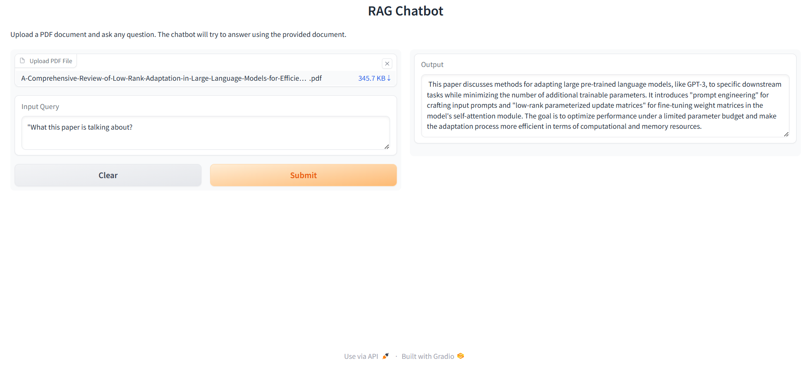

# 💻 QA Bot 🤖 leveraging RAG

A fully functional Question-Answering (QA) app. By leveraging LangChain and a large language model (LLM), the bot 🤖 will be able to read and understand the content of loaded PDF 📃 documents and provide accurate and relevantanswers to user queries.

### 🚀 Features

The app is built in a modular format enabling future adjustments.

-   🔃 **pdf_loader**: Function to load the pdf.
-   🔀 **text-splitter**: tokenizer function to split words into tokens.
-   🔖 **embeddings**: Using an embedding model, convert tokens into numerical representations (embeddings).
-   💾 **vector_store**: Store embeddings into vector daatabase for faster retrieval.
-   🔄️ **retriever**: Retrieve appropriate embeddings based on the input query.
-   💻 **QA-bot**: provide the result in the gradio app.

### Demo

